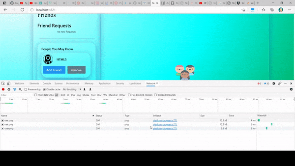

# LazyLoading Components in Angular

* after the lab your file should like like components.directive.final.ts
* if issues copy an paste from components.directive.start.ts


## Start the Facebook Angular App

* download the frontend [here](https://downgit.github.io/#/home?url=https://github.com/WindMillCode/Facebook_Project/tree/master/AngularApp)
* open a terminal and head to project root and run this command
```ps1
npm install -s
npx ng serve -c=facebook --open=true
```

* open 
components.directive.ts
src\environments\environment.facebook.dev.ts
in your text editor


__FILE:environment.facebook.dev.ts__

* in dev additions replace with this code
```ts
    facebook:{
        url:"http://localhost:3005",
        startURL:"/friends"
    }
```

__FILE:components.directive.ts__


## See LazyLoad in Action
* lazy loading means that all the data the website requires is not loaded at once
* open the network pane an look at all the different resources loaded, the more resources loaded the longer it takes for the USER to interact with the site
* why loaded content the user might not interact with yet, or cause delay because of slow browser connection




## Load the component
* we will use the rxjs from operator to convert the import statement to an observable, and delay the appreance of the component showing lazy load in action

* in 'setup the lazyLoad observable' paste this code
```ts
let lazyLoadComponentSub = from(import('../components/components.component'))
.pipe(delay(zChildren[y].extras.options?.component?.lazyLoadDelay || 3000))
.subscribe((result:any)=>{
    let {ComponentsComponent} = result
    // configure the component 

    // 

    // place the component in the DOM

    // 
})
val.subscriptions.push(lazyLoadComponentSub)
```

## The Component Factory

* angular employs plenty of javascript to get the browser to properly conform to the many features we know in angular such as two way binding and decorators. to turn these features into javascript for the browser angular uses theses factories, componentFactory one but many


* components are nothing but elements, they can collectively express a group of items, or be a single item, the ViewContainer however is like a stage for a play(uncomment the .clear() see what happens). Refs and instances are needed for security purposes. components should exist in the view to be dynamic


in 'configure the component ' paste this code
```ts
    let componentsFactory = cfr.resolveComponentFactory(ComponentsComponent)

    let answer  = (zChildren[y].viewContainerRef as ViewContainerRef).createComponent(componentsFactory,undefined,injector)
    let instance:any = answer.instance
    let el:any = answer.location
    instance.options = zChildren[y].extras.options // two-way binding
```

## Place on the DOM

* anytime renderer2 is used also use [changeDectection](https://medium.com/@bencabanes/angular-change-detection-strategy-an-introduction-819aaa7204e7) 
* in 'place the component in the DOM' paste this code
```ts
    renderer2.addClass(
        zChildren[y].element,
        instance.options?.component?.class || null
    )
    renderer2.appendChild(
        zChildren[y].element,
        el.nativeElement
    )
    ref.detectChanges()
```

### Copy and paste
* take the code from component.directive.ts and paste in 
src/app/directive/components.directive.ts reload the page and see the lazyLoad take place