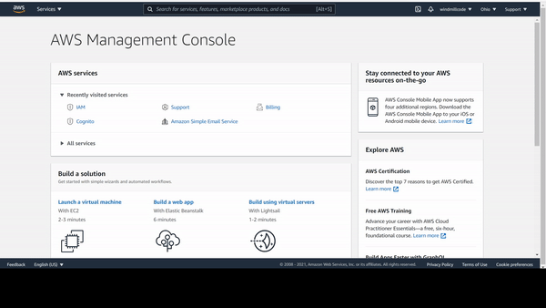

# Setting up your AWS cognito backend for Admin features, Python

* after this lab your project shoud look like template.final.py
* if issues restart from template.start.py


## Youtube
[link](https://youtu.be/YuP4C5jaltY)


## Setup the Python Backend
* download the frontend [here](https://downgit.github.io/#/home?url=https://github.com/WindMillCode/custom_vids/tree/master/aws_cognito)
* open a terminal and head to project root and run these commands
```ps1
cd python

pip install -r windows-requirements.txt --upgrade --target .\site-packages\windows #only for windows

pip install -r linux-requirements.txt --upgrade --target ./site-packages/linux # onlinux
```


## Required files
* open
python/set_backend_env.ps1 # for windows 
python/set_backend_env.sh # for linux 
python template.py    


### Boto3 Cloud Client and admin support
* you need a cognito-idp boto client to work with your cognito IDP  however to work 

in  'if you dont need admin fns ' paste this code
```py
client = boto3.client(
    'cognito-idp',
    aws_access_key_id=     app_client_id,
    aws_secret_access_key= sec_key,
    region_name=os.getenv('COGNITO_REGION_NAME')
)
```

* to use cognito-idp admin, or any boto3 admin fns you need a user that has admin priviliges,
you can either create a user or use the root user, 
you will be need either's access key credentials 

* in 'admin req setup' paste this code
```py 
session_client = boto3.client(
    'sts',
    aws_access_key_id=    root_client_id,
    aws_secret_access_key=root_client_secret,
    region_name=cognito_region
)
session_info = session_client.get_session_token()
session_token = session_info.get("Credentials").get("SessionToken")
session_access_key_id = session_info.get("Credentials").get("AccessKeyId")
session_secret_access_key = session_info.get("Credentials").get("SecretAccessKey")

client = boto3.client(
    'cognito-idp',
    aws_access_key_id=    session_access_key_id,
    aws_secret_access_key=session_secret_access_key,
    aws_session_token=session_token,
    region_name=cognito_region
)
```

#### Use the Root account 

Head to your accounts security credentials


__FILE set_backend_env.ps1/sh__
* for ROOT_USER_CLIENT_ID
ROOT_USER_CLIENT_SECRET

paste values accordingly 

#### Use a IAM user acct with admin account 
* Head to your users in nav dropdown same area where security credentials are
* [Add User] 

Select AWS access type -> programmatic access 

Set permissions -> attach existing policies directily -> 

no tags

Create User


__FILE set_backend_env.ps1/sh__
for  STS_USER_CLIENT_ID
STS_USER_CLIENT_SECRET

paste values accordingly 


### Cognito User Pools
* in cognito there are two types of pools you can create user and identity pool, 
* in the search bar in the aws console type in cognito and select the first option from the dropdown

create a user pool 

name:my_sample 

[Step through settings] 

[How do you want your end users to sign in?] -> email address, allow email addresses [Next step]

[What password strength do you want to require?] uncheck all boxes  -> [next step]

[enable MFA] -> optional ,TOTP MFA (for authenticator app)
* to setup TOTP MFA, in a fullstack application refer [here]( https://www.youtube.com/watch?v=2nSQpAEwLRc) and in the resources section of the lab , code sample will be provided

[Do you want to customize your email address?]
* all steps for user self acct managmement through email

[Next-step]
[Tags]
[Next-step]
[Devices]
[Next-step]
[App Clients] -> [add an app client]

name:my_sample_app_client
* I would like the refresh token to be much shorter
Auth Flows Configuration: check [(Enable username-password (non-SRP) flow for app-based authentication (USER_PASSWORD_AUTH))]

[Lambda triggers]
[Next-step]
[Create Pool]


__FILE set_backend_env.ps1/sh__

* for
COGNITO_REGION_NAME
COGNITO_USER_POOL_ID
* look at the Pool Id its the first part of thes string
* paste values accordingly

[App client settings]
Enable Cognito User Pool Identity providers

[App client 

* for 
COGNITO_USER_CLIENT_ID
COGNITO_CLIENT_SECRET

grab and use the App client id,App client secret

### Start the Python backend
* set your env vars and run 
```ps1
python tornado_server.py
```

#### Use the HTTP client of your choice 
* you can build a front however we will be using the VSCode Thunder Client extension
* feel free to use postman,etc ... and follow along 


### The application 

#### Secret hash decorator fn 
* most of these endpoints need a secret hash to work 
in 'setup secret hash' paste this code
```py	
                message = bytes(username+app_client_id,'utf-8')
                key = bytes(sec_key,'utf-8')
                secret_hash = base64.b64encode(hmac.new(key, message, digestmod=hashlib.sha256).digest()).decode()
```

#### Create an account 
* in thunder client in the url paste
"http://localhost:3006"
the method is POST
in BODY , the type is JSON, paste this code
	* unfortunatly all keys must be in double quotes
```json
{
	"env":"createAccount",
	"user":"shieldmousetower734@gmail.com",
	"pass":"I_love_apples" 
}
```

copy the verification code from your email 

071449

#### Confirm your account 
in Body paste this json 
```json
{
	"env":"confirmAccount",
	"user":"shieldmousetower734@gmail.com",
    "pass":"I_love_apples",
	"conf_code":"110260" 
}
```

copy the access token  your dummy account is logged into the cognito API, and you need this token for any requests you make to the backend
    * according to how the backend is setup the refresh token is set as a secure cookie
```py 
access_token = """
long access token string
"""
```

### Change password 
in Body paste this json 
```json
{
	"env":"changePass",
    "old_pass":"I_love_apples",
    "new_pass":"I_love_apples_again",
    "access_token":"long access token string"
}
```
hit send

### Sign In

in Body paste this json 
```json
{
	"env":"signIn",
	"user":"shieldmousetower734@gmail.com",
    "pass":"I_love_apples_again"
}
```

* grab the access token as needed

* while you explore the template.py detemine how you can add to it and determine how you can use other endpoints 

### Delete Account 

in Body paste this json 
```json
{
	"env":"deleteAcct",
    "access_token":"long access token string"
}
```


### Resources

[TOTP MFA, Authenticator App](https://www.youtube.com/watch?v=2nSQpAEwLRc)
```py
# TOTP MFA, authenticator app code format
"otpauth://totp/{2}:{0}?secret={1}&issuer={2}".format(username,response.get("SecretCode"),your_app_name)
# 
```
[boto3 cognito IDP client](https://boto3.amazonaws.com/v1/documentation/api/latest/reference/services/cognito-idp.html)
[Using Refresh and Access Tokens with In Memory User Auth](https://www.youtube.com/watch?v=ZSbD5N-bDEo)