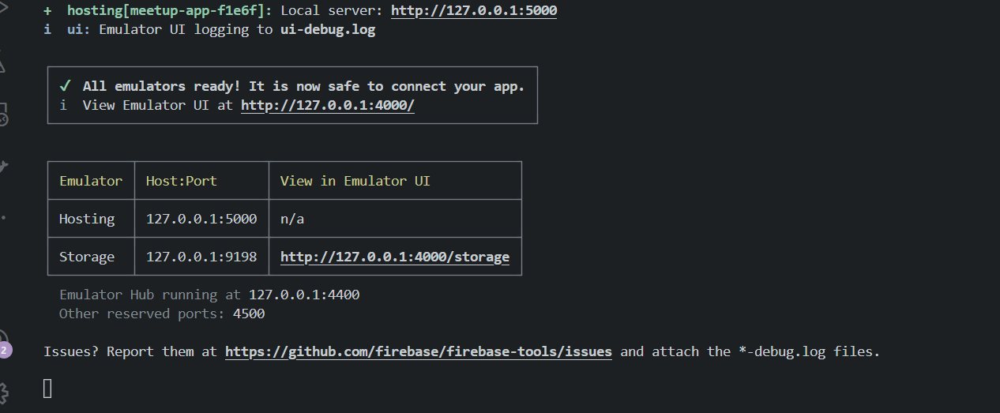
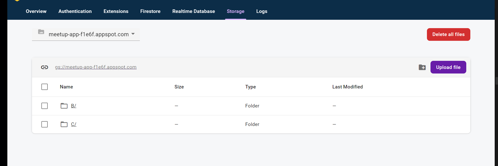
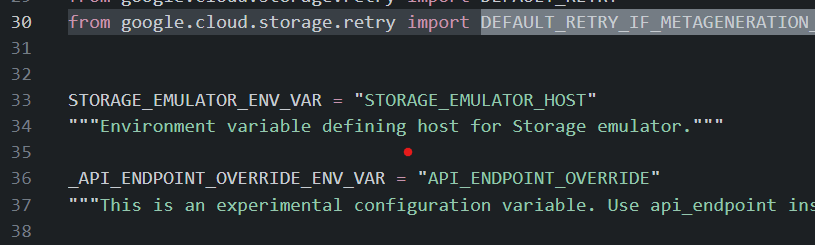

# Connecting to Firebase Emulators via python

* [youtube link](https://www.youtube.com/watch?v=la3hXW7Xvu8)

## Requirements
Node.js  v18 or higher install using nvm
Python 3.11 or higher install using pyenv
Java 17 or higher install using jabba

## Steps

### windows and vscode
* if you have windows and vscode clone the repo using downgit and the application should automatically run if there are errors
"Ctrl Shift P(hold Ctrl Shift togther then hit P)" to open the command pallete
* type "Run Task" and hit enter
* chose the options suffixed with "install app deps" and chose "never scan the task output for shell tasks" or something like that
* after all the deps have install you will want to do
* "Ctrl Shift P(hold Ctrl Shift togther then hit P)"
* type "Run Task" and hit enter
* the select the tasks one by run which are suffixed with "run" to run all the needed apps

### Other envniroments
* the Flask app is located at apps/zero/backend/FlaskApp
* you will need to make you cd to that directory
* install app deps using the following command referring to this map to replace windows with your opoerating system

mac:{
  darwin-requirements.txt,./site-packages/darwin",
}
linux:{
  linux-requirements.txt,./site-packages/linux"
}
```sh
" cd apps\\zero\\backend\\FlaskApp; pip install -r windows-requirements.txt --upgrade --target .\\site-packages\\windows",
```
then set your env vars
  \$gae is the path to your  GOOGLE_APPLICATION_CREDENTIALS json file
  you need to make a firebase project which automatically creates a GCP projects and places firebase in the GCP project
  go to console.cloud.google.com
  make sure you select the project related to your firebase project in the droddown on  the left of the serach bar
  you then need to go to IAM > Service Acounts and find the firebase service account click on it
  Keys > create new key > JSON  and store the key on a secure location in your computer
  do not let it be committed to github or a hacker might gain access to it and google will charge you $1000's of dollars
```sh
export FLASK_BACKEND_ENV="DEV"
export STORAGE_EMULATOR_HOST="http://localhost:9198"
export AUTH_EMULATOR_HOST="http://localhost:9099"
export GOOGLE_APPLICATION_CREDENTIALS=$gae
```


then run the flask app with this command
python app.py

* the Firebase Emulator App is located at apps/zero/cloud/firebase
* you will need to make you cd to that directory
* install app deps using the following command
```sh
npm install -g yarn;yarn install
```
* or if you dont like yarn
```sh
npm install s
```
* help make a firebase emulator bug report, because there is no proper way to shut down the emulator until then use this command to start the emulator
```sh
npm run cleanup;npx firebase emulators:start --import='devData' --export-on-exit
```

### Seeing your bucket data
go to the storage emulator at http://127.0.0.1:4000/storage, check the terminal where the emulator is running and go to the url there


then add some folders and files


using thunder client or postman or any method you use to make an api call,
use the following code to make an api call and see if the result corresponds to what you have in the bucket

```py
import requests
import json

reqUrl = "http://127.0.0.1:5003/scratchpad/get-storage-buckets"

headersList = {
 "Accept": "*/*",
 "User-Agent": "Thunder Client (https://www.thunderclient.com)",
 "Content-Type": "application/json"
}

payload = json.dumps({
  "data":"None"
})

response = requests.request("POST", reqUrl, data=payload,  headers=headersList)

print(response.text)
```


### How it works
__FILE__ apps\zero\backend\FlaskApp\managers\firebase_manager.py
this is our service if you will, on it we specify the bucket name that the emulator is using according to the GOOGLE_APPLICATION_CREDENTIALS which is the project id then we call connect_to_firebase_https to connect our flask app to the emulator, this does not do anything yet

__FILE__ apps\zero\backend\FlaskApp\configs.py
here we leverage design patters such as singleton to organize our managers you can see firebase_manager being init in there

__FILE__ apps\zero\backend\FlaskApp\endpoints\scratchpad_endpoint.py
we call
```py
CONFIGS.firebase_manager.get_storage_data()
```
and use APIMSGFormat to return the data, in your flask apps you should not be returning strings or JSON  but use a class such as APIMSGFormat to standardize responses in your app

__FILE__ apps\zero\backend\FlaskApp\site-packages\windows\google\cloud\storage\_helpers.py
how we knew what to set line 33 of this file made it as simple as that

the app works with these versions hopefully google does not watch this and leaves it alone for everyone to use
```txt
firebase-admin==6.1.0
Flask==2.3.2
gevent==22.10.2
google-api-core==2.11.0
google-api-python-client==2.87.0
google-auth==2.19.0
google-auth-httplib2==0.1.0
google-cloud-core==2.3.2
google-cloud-firestore==2.11.1
google-cloud-storage==2.9.0
google-crc32c==1.5.0
google-resumable-media==2.5.0
googleapis-common-protos==1.59.0
greenlet==2.0.2
grpcio==1.54.2
grpcio-status==1.54.2
```


