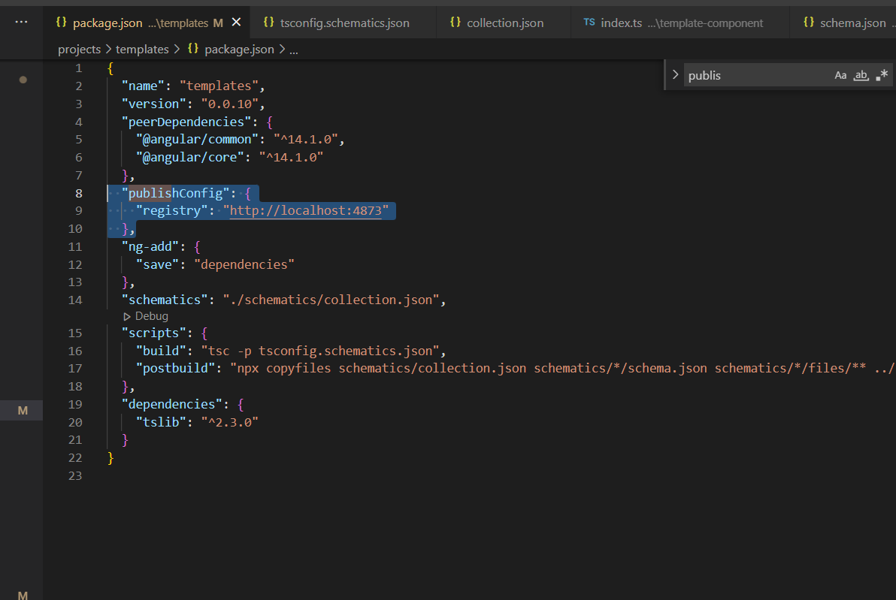
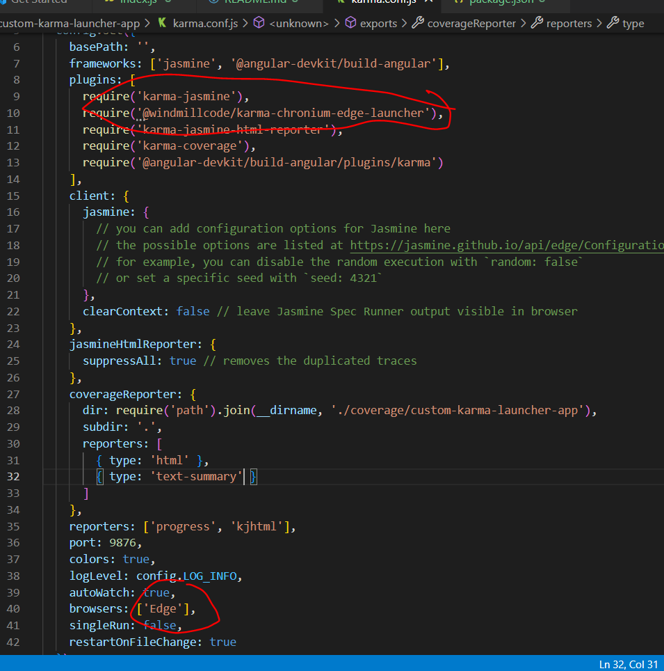

# Creating your own custom karma launcher

## Understanding the files
* this is a package that will ultimately end up in an angular application
* index.js is where the work is done
* here were are going to use chronium edge as the browser of choice
* karma works based on DI  pattern which is related to builder pattern , basically you have a launcher and the features you will need are added as optional dependencies
* the this._getOptions function is to retrieve the command line arguments for the browser executable you need to run
* this._processOnExit is how to kill the browser session
* you can better understand the function you can overwrite in __node_modules\karma\lib\launchers\process.js__

## Deploy to a registry via verdaccio
* install verdaccio and run a simple npm registry
```
npm install -s verdaccio;npx verdaccio
```
* deploy to npm
```
npm publish --registry http://localhost:4873
```
or better yet

* the publishConfig prop

## Install in your angular app 
in custom-karma-launcher app
```
npm install --save-dev @windmillcode/karma-chronium-edge-launcher
```

FILE __custom-karma-launcher-app\karma.conf.js__


* run the app
```
npx ng test
```


