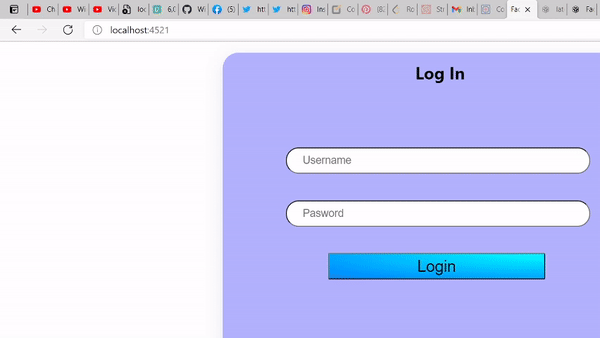

# In Memory User Authentication and Session Persistence with Angular, Heroku and CodeSandbox(Python Backend)

* after this lab your project shoud look like AngularAppFinal
* if issues restart lab from AngularAppStart

## Start the Angular app
* download the frontend [here](https://downgit.github.io/#/home?url=https://github.com/WindMillCode/Facebook_Project/tree/master/AngularApp)
* open a terminal and head to project root and run this command
```ps1
cd AngularApp
npm install -s
npx ng serve -c=http --open=true
```


## Required files
* open
AngularApp\src\app\directive\login.directive.ts
AngularApp\backend\python\tornado_server.py
AngularApp\backend\python\tornado_heroku_server.py
AngularApp\backend\python\template.py


## Refresh Token and Access token
* we use the access token when we are logged in and need to continue to access resources related to logged in user
* we use the refresh token to persist the in memory session however the client needs a way to hold on to in


__FILE__ - login.directive.ts
* // send the user credentials to the backend
* next to 'let request ' paste 
	* when sending withCredentials=true, there are requirements, the request must be GET, and by default it wants the same domain,site,origin ..., modern browsers by default are implementing these stops to help developers and end users 
	* however if we bypass the http method by providing the Content-Type:"text/plain", the preflight will go through and the client will be able to persist the refresh token explained in the python ste
	[resource](https://developer.mozilla.org/en-US/docs/Web/API/XMLHttpRequest/withCredentials)
	* now we can do everything in one request sending the credentials over to the backend, with services there to turn our ts object string into python dict
```ts
= http.post(
	env.login.url,
	JSON.stringify({
		env:"login",
		user,
		pass
	}),
	{
		withCredentials:true,
		headers:{
			"Content-Type":"text/plain"
		}
	}
)
.subscribe({
	next:(result:any)=>{

		// place the token and credentials in memory
		ryber.appCO0.metadata[appExtras.name].credentials = {
			token:result.token,
			user:result.user
		}
		//


		// change the path
		ryber.appCO0.metadata.navigation.full.navigated = "true"
		ryber.appCurrentNav = "/home"
		//

	},
	error:(err:HttpErrorResponse)=>{

	}
})
```

__FILE__ - template.py

* in incorrect password paste this code
	* we send a 401, meaning unauthorized, this means the server doesnt know who you are and wont give you resources related to what you seek
```py
return  {
		'status':401,
		'message':'Login Failed'
	}
```


*in ' get the user/pass credentials' paste this code
	* proper indentation
	* we setup login so we wont try to send a different access token and snap the session persistence,we also want to give the frontend 3 chances to send the correct access token because even though hackers exist sometimes the true frontend can face a # of difficulties getting the access token over to the right spot in one piece this value should be random 
```py
                target_dict = my_login_dict.get(username)
                if(target_dict.get("pass") == password):
                    target_dict["login"] = True
                    target_dict["tries"] = 3 | random.choice(range(5))
```

* in return the token paste this code
	* the payload may not be the correct way to set expiration, refer to pyJWT and reach out with a pull request in the repo
	* the access_token is short lived because say a user refershes the page, or a nav step, the frontend will use the refresh token to get a new access token and persist the session
```py
                    access_token= jwt.encode(
                        payload={
                            "expiration":str(datetime.utcnow() + timedelta(seconds=120)),
                        },
                        key=target_dict.get("secret"),
                        algorithm="HS256"
                    )
                    refresh_token= jwt.encode(
                        payload={
                            "expiration":str(datetime.utcnow() + timedelta(minutes=120))
                        },
                        key=target_dict.get("secret"),
                        algorithm="HS256"
                    )
                    return {
                        'status':200,
                        'refresh_token':refresh_token,
                        'refresh_user':username,
                        'message':json.dumps(
                            {
                                'message':'allow user to proceed',
                                'avatar':target_dict.get("avatar"),
                                'token':access_token
                            }
                        ),
                    }

```


___FILE__ - tornado_server.py
* in 'send the refresh_token as a httpOnly cookie' paste this code
	* httponly means that the cookie cannot be accessed by javascript, we can make it more difficult to access 
	* in the application pane in the browsers developer tools,(chromium based) we can see where our cookies will be stored, keep it open 
	* from the withCredentials = true in our frontend, it allows that specific request to store cookies in our frontend given by the backend response
	* this is how we set them in tornado

```py
self.set_cookie("refresh_token",refresh_token,httponly=True)
self.set_cookie("refresh_user",result.get("refresh_user"),httponly=True)
```

* in 'setup the headers' paste this code if you need to get going quickly
* plenty of important stuff here are some resources
* this section of the HTTP language is known as [CORS](https://developer.mozilla.org/en-US/docs/Web/HTTP/CORS)
```py
if(self.request.headers['Origin'] in ["http://localhost:4521","https://windmillcode.github.io"]):
	self.set_header("Access-Control-Allow-Origin",self.request.headers['Origin'])
self.set_header("Access-Control-Allow-Headers", "*")
self.set_header("Access-Control-Allow-Credentials","true")
self.set_header("Allow-Origin-With-Credentials","true")
self.set_header('Access-Control-Allow-Methods', 'POST, GET, OPTIONS')
```

### Start the Python Backend 
* in a new terminal head to project root
* cd to backend/python 
* run
```ps1
cd backend/python
pip install -r requirements.txt --upgrade  --target .\site-packages    
python tornado_server.py
```

now from the frontend provide this to the interactive

u: Angular
pass:Def

you should be logged into the homepage also check the devTools application panel for the cookies from the backend

## Persist the session
* when we refresh the page however we are brought to login screen, this isnt good however we can solve this

__FILE__ - login.directive.ts
* in 'get a new access token on refreshing the page' paste this code next to 
'let myCheck
	* usually this step would be done in a get request to another endpoint however, the backend certainly behaves like graphQL, we would want to disrupt that lint, 
	* withCredentials means "send the cookies that the backend has stored on it" once the backend has validated the refresh token we get new access token in the subscribe callback
	* REMEMBER without that refresh token, the user will be logged and should reflect that in your application
```ts

http.post(
	env.login.url,
	{
		env:"refresh_page"
	},
	{
		withCredentials:true,
		headers:{
			"Content-Type":"text/plain"
		}
	}
)
.subscribe({
	next:(result:any)=>{

		// place the token and credentials in memory
		ryber.appCO0.metadata[appExtras.name].credentials = {
			token:result.token,
			user:result.user
		}
		//


		// change the path
		ryber.appCO0.metadata.navigation.full.navigated = "true"
		ryber.appCurrentNav = "/home"
		//
	},
	error:(err:any)=>{

	}
})
```

__FILE__ - template.py


* in 'validate the refresh token' paste this code
	* its important not to receive the refersh token alone, but use metadata lookup, here we ask for the name alone, but in prod step provide more non-user metadata to unique idenitfy the token with a user before even checking if the token is valid as indicated by the decorator fn
```py
                refresh_user= data.get("refresh_user")
                refresh_token= data.get("refresh_token")
                @self.token_required
                def refresh_page(token,user):
                    target_dict = my_login_dict.get(user)
                    target_dict["login"] = True
                    target_dict["tries"] = 3
                    access_token= jwt.encode(
                        payload={
                            "expiration":str(datetime.utcnow() + timedelta(seconds=120)),
                        },
                        key=target_dict.get("secret"),
                        algorithm="HS256"
                    )
                    return {
                        'status':200,
                        'message':json.dumps(
                            {
                                'message':'allow user to proceed',
                                'user':user,
                                'avatar':target_dict.get("avatar"),
                                'token':access_token
                            }
                        ),
                    }
                return refresh_page(refresh_token,refresh_user)
```

* return to the frontend login with the credentials, refresh the page and see if we are still on the homepage
u:Angular 
p:Def


## Production

__FILE__ tornado_heroku_server.py

* look at the code between " when frontend and backend are not on the same domain" ,
 tornado makes this simple for us to scale for the application to work in production,
 head to [frontend production url](https://4r1ux.csb.app/). Deploying the frontend and backend production is beyond the scope of this lab. but use this lab as a refrence of how to setup your own apps in the stacks for your project

 


